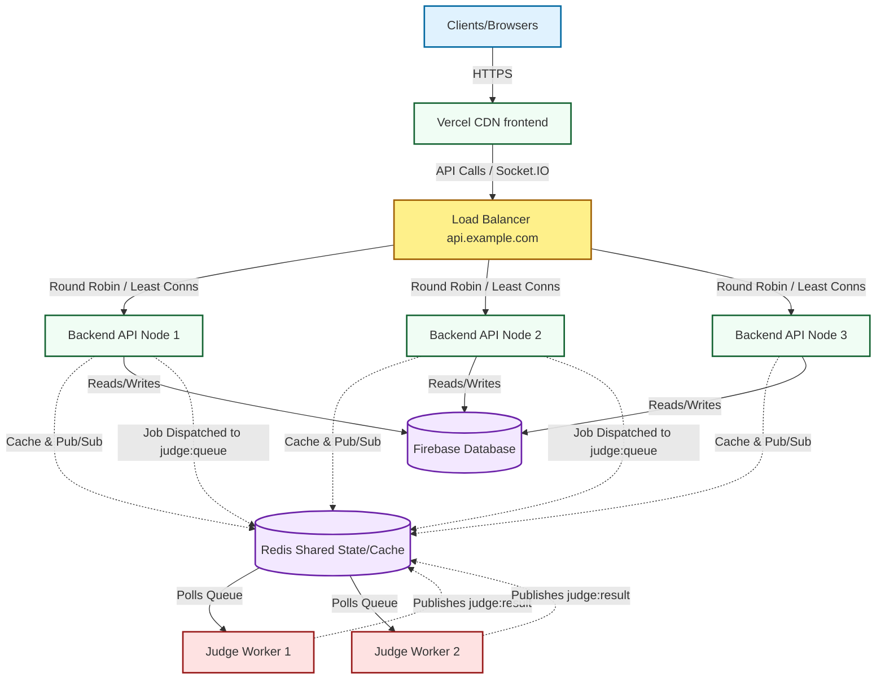

# Coding Club Deployment Architecture

This guide outlines how to deploy the Coding Club assessment platform for high-traffic scalability (~1000+ users), ensuring resilient load balancing across multiple API instances and totally isolating code execution limits.

## 1. System Architecture Diagram

---

## 2. Setting Up Redis (The Heart of Distributed Architecture)

Redis is fully required for this high-traffic deployment. It actively manages:
- **Rate-Limiting**: (via `rate-limit-redis`) to track user requests across multiple load-balanced API Nodes.
- **WebSocket Synchronization**: (via `@socket.io/redis-adapter`) to broadcast Admin notifications to students across completely different server nodes.
- **Judge Queuing**: Allowing our stateless API nodes to enqueue compile/run tasks and poll for responses without hanging waiting.
- **Heavy Data Caching**: Temporarily holding high-throughput endpoints like `getPublicQuiz().`

**Action**: You can provision a small Redis instance free from Upstash or Render. Grab your `REDIS_URL`.

---

## 3. Render API & Judge Worker Deployment (Backend)

We provided a native `render.yaml` inside your `/backend` directory.
1. Connect your Github Repository to Render.
2. Select **"Blueprint"** deployment in Render, and point it to `/backend/render.yaml`.
3. Render will instantly provision:
   - A Redis Cluster (`cache-redis`).
   - 3 Web API instances that auto scale CPU load (`coding-club-api`).
   - 2 Background Judges pulling execution jobs (`coding-club-judge-worker`).
4. Apply your Firebase credentials via Render's secure Environment Variable Secrets form. Remember to omit the literal `"` characters and handle the `\n` linebreaks correctly in your `FIREBASE_PRIVATE_KEY`!

---

## 4. Scaling the Code Judge
Code submitted by students is *no longer executed inside the API server*. The API strictly drops the compilation source into Redis `judge:queue`.
- If you have an event with 5,000 students, your API will remain unbelievably fast because code doesn't slow down the load balancer.
- The `judge-worker` securely processes these isolated queues under CPU limits. You can linearly scale `coding-club-judge-worker` to 10 instances on Render to instantly increase execute capacity.

---

## 5. Vercel CDN Deployment (Frontend)
1. Add your repository to **Vercel**.
2. Within the `/frontend` directory configuration, specify the target variables in Vercel.
3. VERY IMPORTANT: Change `VITE_API_URL` to point to exactly **one specific load-balanced URL**, heavily resembling `https://api.your-backend.com`.
`VITE_API_URL` MUST NOT point to the Render internal IPs, because browsers need HTTPS.

## 6. Socket.IO Cross-Instance Compatibility
Our setup utilizes the standard Socket.io implementation paired elegantly with the Redis Adapter (`backend/src/realtime.js`). 
This guarantees that if the Load Balancer connects an Admin to Node 2 and a Student to Node 1, when the Admin clicks "Force Submit Student", the Event seamlessly traverses the Redis Pub/Sub stream directly to the Student.

## 7. Graceful Degradation & Failure Testing
Your endpoints are heavily fortified to withstand PaaS (Render) restarts seamlessly:
- **SIGTERM Interruptions**: Server intercepts kill requests, severing active WebSockets gracefully and instructing them to migrate to another healthy backend inside the load balancer while draining existing HTTP queries safely.
- **Node Deaths**: The Load Balancers rely on `/api/health`. If Node 3 hangs or crashes, traffic is transparently routed to nodes 1 and 2.
- **Redis Outages**: If Redis crashes, standard RateLimiting drops down effortlessly to in-memory mode per node, and APIs fallback strictly to synchronous rendering instead of Caching errors.

## 8. Post-Deploy Checklist
- [ ] Vercel domains are HTTPS locked.
- [ ] Render `.env` contains `FIREBASE_PROJECT_ID`, `FIREBASE_CLIENT_EMAIL`, and `FIREBASE_PRIVATE_KEY`.
- [ ] Test the `/api/health` endpoint against your Render deployment URL.
- [ ] Test real-time syncing between two isolated tabs.
- [ ] Test "Run Snippet" from a student account and verify that it resolves correctly (Meaning Redis AND Judge Workers are healthy)
